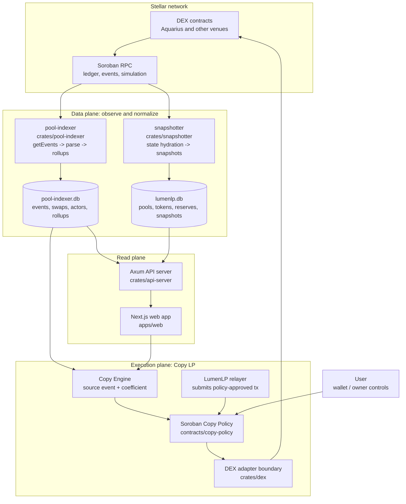
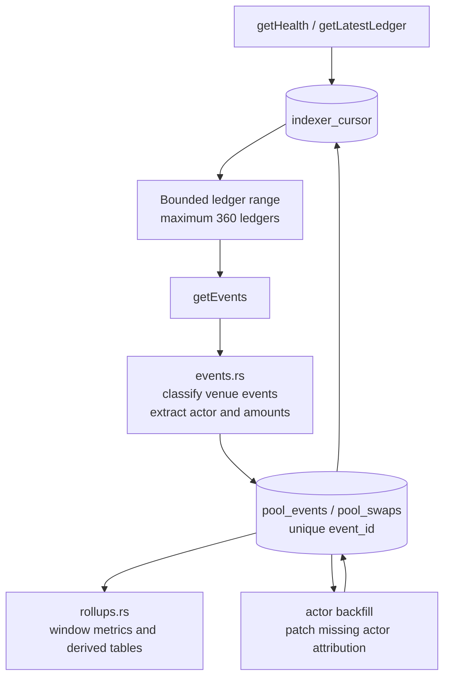
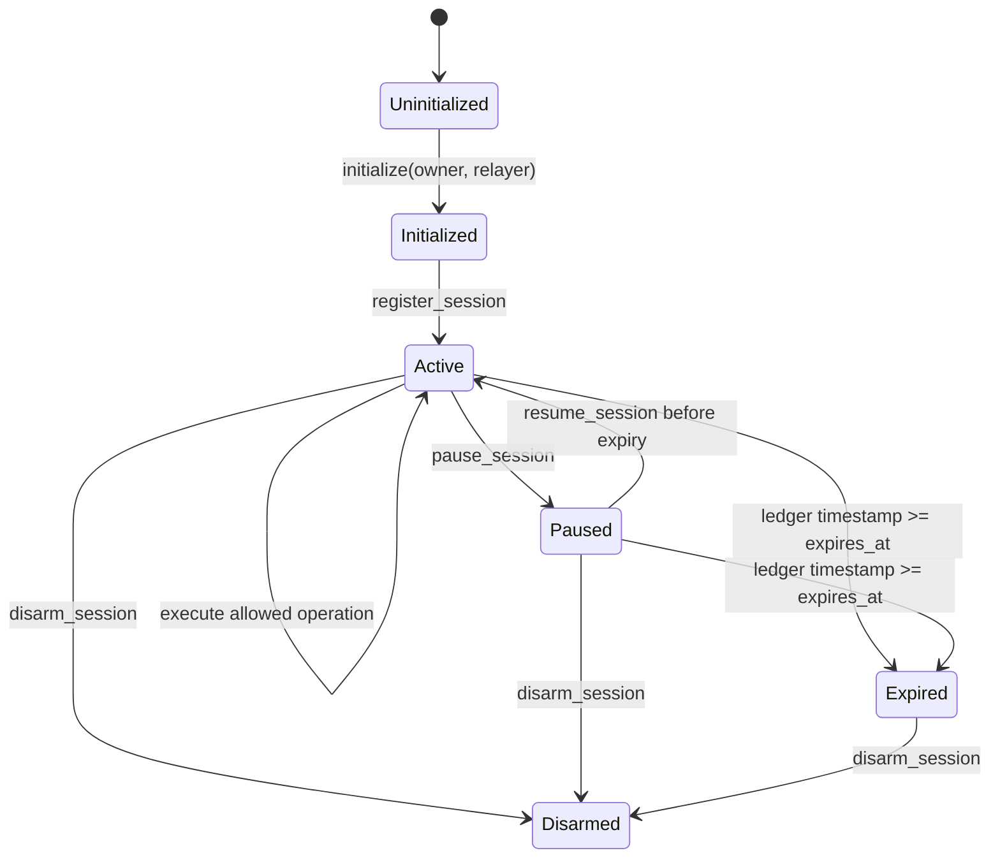
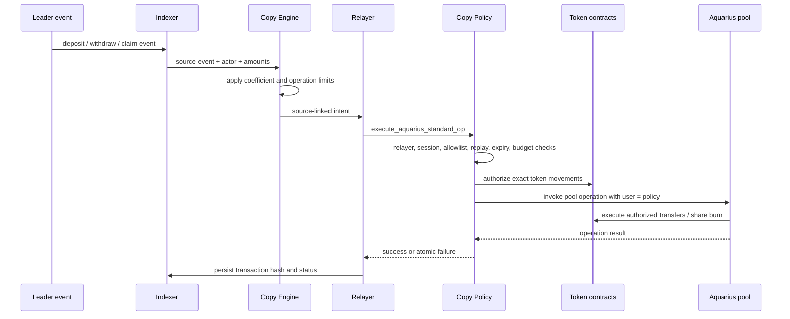

# LumenLP Architecture

LumenLP is a Stellar-native LP discovery, analytics, and Copy LP product. It starts with Aquarius and uses Soroban RPC plus a local event indexer as its data foundation.

## Executive Summary

The existing product is a production analytics and user-reviewed Copy LP
system. It observes Stellar DEX activity, normalizes pool and LP events, and
exposes pool and Leader signals through a public API and web application. The
grant work extends this base into a policy-controlled automation path rather
than replacing the existing data plane.

The security boundary is Soroban, not the web application or the relayer. An
off-chain indexer may observe an event and create an intent, but only the Copy
Policy contract can authorize a declared LP operation. The relayer submits a
transaction and never receives custody of user funds. Aquarius is the first
production venue; additional Stellar DEX venues are added through the common
adapter boundary only after their pool state, event model, and operations are
validated.

The grant target is therefore a staged path from user-reviewed execution to
limited, policy-controlled automation on Testnet and then Mainnet. Arbitrary
swaps, unrestricted contract calls, and a generic custodial vault are outside
the scope.

The product has two connected surfaces:

1. **LP intelligence:** discover pools and inspect observable liquidity-provider activity.
2. **Copy LP:** select a Leader, scale selected LP actions, and prepare or execute the follower operation without taking custody of user funds.

The current production system is RPC-first and non-custodial. The website and API do not claim complete historical PnL when the indexed data cannot prove it.

## Product Boundary

### Current focus

- Aquarius pool discovery and ranking.
- Pool TVL, liquidity, fee, Fee/TVL, and activity metrics.
- Pool snapshots and historical windows.
- LP event indexing with actor attribution where available.
- Leader discovery from observed LP activity.
- Copy LP sessions and scaled operation queues.
- User-reviewed transaction drafts.

### Deferred capabilities

- Production rollout of Soroban policy-controlled automatic execution remains
  gated by security and operational validation. The Testnet policy vertical
  slice and real Aquarius deposit/withdraw path are already implemented.
- Broader LumenLP relayer operation coverage and production hardening.
- CLMM range copy and rebalance depth.
- Optional fee-token conversion through LumAgg.
- Additional liquidity protocols, only if they directly support the Copy LP product.

LumenLP does not mirror arbitrary Leader swaps. A swap can be a fee exit, a position adjustment, or an unrelated trade. Fee-token conversion is a separate, explicitly authorized LumAgg flow.

## System Overview



The web application is statically exported and deployed to Cloudflare Pages.
The API is exposed through `https://api.lumenlp.xyz`; private service routing
between Nginx, the API, indexer, snapshotter, and RPC is intentionally omitted
from this public architecture document.

### Architecture at a glance

| Plane | Implementation | What it does | Durable output |
|---|---|---|---|
| Data plane | `crates/pool-indexer` | Reads bounded Soroban `getEvents` ranges, classifies LP lifecycle events, attributes actors, advances a ledger cursor, and builds time-window rollups. | `pool-indexer.db` |
| State plane | `crates/snapshotter` + `crates/dex` | Discovers pools, reads tokens/reserves/fees/shares through RPC simulation, resolves prices, and records snapshots. | `lumenlp.db` |
| Read plane | `crates/api-server` + `apps/web` | Joins indexed events and snapshots into pool, Leader, Copy LP, and status APIs and renders the UI. | JSON responses and user views |
| Execution plane | `contracts/copy-policy` + relayer + `crates/dex` | Validates session scope on Soroban, authorizes only declared token movements, and invokes the selected DEX adapter. | On-chain policy state and transaction history |

The key separation is intentional: the indexer observes and proposes source
events off-chain, while the Soroban policy contract is the final authority for
whether an automated LP operation can execute.

## Repository Structure

```text
lumenlp/
├── apps/web/                  Next.js reference web application
├── crates/
│   ├── api-server/             Axum API and application orchestration
│   ├── dex/                    Soroban RPC, Aquarius integration, pool DB
│   ├── metrics/                TVL, fee, pricing, and LP math
│   ├── pool-indexer/           Contract event ingestion and rollups
│   └── snapshotter/            Periodic pool hydration and snapshots
├── deploy/                    systemd, Nginx, and deployment scripts
├── docs/                      Architecture, methodology, and grant material
└── thirdparty/                Local protocol source references
```

## Data Flow

### Pool catalogue and snapshots

The Snapshotter periodically discovers Aquarius pool addresses through the Aquarius router. It hydrates pool state from Soroban RPC and stores pool metadata and snapshots.

```text
Aquarius router
      │ discover pool addresses
      ▼
Snapshotter
      │ get pool type, tokens, reserves, fee, shares
      ▼
Price book
      │ native XLM and supported pool paths
      ▼
TVL / fee metrics
      │
      ▼
lumenlp.db
```

The current snapshotter runs as a systemd timer every five minutes and snapshots the configured top-N pools by reserve depth. A pool can remain in the catalogue even when its current price path is incomplete; in that case its snapshot is stored with an unavailable or zero-valued quote metric rather than an invented price.

### Event and swap indexing

The Pool Indexer continuously scans contract events from the configured Soroban RPC. It persists raw and derived events, swap observations, cursor state, and rollup tables.

```text
Soroban RPC getEvents
      │
      ▼
PoolEventScanner
      │ parse Aquarius event topics and payloads
      ▼
pool-indexer.db
      │
      ├── pool events
      ├── swaps
      ├── actor-tagged liquidity activity
      ├── window rollups
      └── indexer status / cursor
```

The indexer is incremental. It stores a ledger cursor and advances it in bounded ledger ranges so a temporary lag does not create an unbounded RPC request. Missing liquidity actors can be re-parsed by the actor backfill pass when the required event data is still available from the RPC retention window.

If the saved cursor falls outside the RPC retention window, the indexer clamps to the oldest available ledger. Older history requires a third-party historical source, an earlier archive, or another archive data provider.

### Indexer implementation at a glance

The indexer is an incremental, restartable pipeline rather than a one-shot
RPC scraper:



Implementation boundaries:

- `crates/pool-indexer/src/main.rs` owns startup, health checks, polling,
  bounded ranges, cursor advancement, and the optional backfill command.
- `crates/pool-indexer/src/events.rs` decodes Soroban event topics and values,
  classifies LP lifecycle events, and resolves the transaction source account
  when the event does not carry an actor directly.
- `crates/pool-indexer/src/db.rs` uses unique event identifiers and
  `INSERT OR IGNORE` semantics so retries are idempotent. If an event was
  initially stored without an actor because of an RPC lookup failure, a later
  pass can patch only the derived actor field.
- `crates/pool-indexer/src/rollups.rs` derives time-window activity from the
  canonical event tables; rollups are disposable and can be rebuilt from
  indexed events.

The cursor is advanced only after a bounded range has been persisted. A
process crash can therefore repeat a range without duplicating events. A
cursor outside the RPC retention boundary is clamped and reported in status;
the system does not claim that the unavailable older history is complete.

### API read path

The API Server combines both databases with live RPC reads and pricing helpers:

```text
HTTP request
    │
    ▼
Axum handlers
    │
    ├── lumenlp.db          pool metadata and snapshots
    ├── pool-indexer.db     events, swaps, rollups, Leader activity
    ├── Soroban RPC         live positions and contract state
    └── PriceService         token metadata and quote conversion
    │
    ▼
Normalized JSON response
```

Important API surfaces:

| Endpoint | Purpose |
|---|---|
| `GET /health` | Service health |
| `GET /v1/indexer/status` | Indexer cursor and counts |
| `GET /v1/pools` | Ranked pool list and window metrics |
| `GET /v1/pools/{address}` | Pool detail and latest state |
| `GET /v1/pools/{address}/history` | Snapshot history |
| `GET /v1/pools/{address}/events` | Recent pool events |
| `GET /v1/lp/leaders` | Leader ranking from indexed activity |
| `GET /v1/lp/profile` | One Leader's activity and exposure |
| `GET /v1/positions` | Positions for an account |
| `GET /v1/copy/sessions` | Copy sessions |
| `GET /v1/copy/sessions/{id}/ops` | Scaled Copy LP operations |
| `GET /v1/venues` | Current protocol support status |

## Metric Methodology

### TVL

TVL is computed from current pool reserves and a quote price book:

```text
TVL = sum(reserve_i × price_i_in_quote_asset)
```

The current quote basis is XLM where a usable price path exists. User-facing fields must state the quote unit and must not present XLM estimates as USD.

### Fee and Fee/TVL

Fee values are derived from observed swap activity and the pool fee configuration. Fee/TVL is a windowed efficiency signal:

```text
Fee/TVL(window) = estimated fees in window / current TVL
```

It is not a guaranteed APR and should be interpreted together with data coverage, liquidity changes, and pool activity.

### Leader activity

Leader rankings use observable indexed activity such as:

- claimed fees;
- deposits and withdrawals;
- net liquidity change;
- pools touched;
- current open exposure;
- event frequency and recency.

These are data signals, not a promise of profit. Unless cost basis and complete history are available, the UI must not label them as complete PnL, win rate, or guaranteed earnings.

## Planned Stellar Integration

LumenLP is a Stellar-specific application. Its core workflow integrates directly with Stellar mainnet contracts and Soroban infrastructure rather than importing generic DeFi data from an external chain.

The target LP venue set for this integration is **Aquarius, Phoenix, Sushi,
Soroswap AMM, and Comet**. Aquarius is the first production reference
implementation. The other venues will be enabled progressively through the
same adapter boundary after their pool state, event semantics, token flows,
and LP entrypoints pass venue-specific validation. Stellar Classic DEX is not
included in this LP pool adapter scope: it is an order-book exchange rather
than an AMM/LP pool venue and would require a separate market-data and trading
architecture.

### Aquarius AMM integration

Aquarius is the first and current production venue. LumenLP integrates with Aquarius in four ways:

1. **Pool discovery**
   - Read the Aquarius router through Soroban RPC.
   - Discover pool addresses from the router's token-set catalogue.
   - Read each pool's token list, pool type, fee configuration, reserves, and total shares.
   - Support the current Aquarius pool families: constant-product AMM, stable pools, and concentrated liquidity pools where the required state is available.

2. **Pool analytics**
   - Hydrate pool state from contract simulation and RPC reads.
   - Build an XLM-normalized price book from native-XLM and connected pool paths.
   - Compute TVL from on-chain reserves and the price book.
   - Persist periodic snapshots for historical TVL, fee, Fee/TVL, and activity windows.

3. **Liquidity event indexing**
   - Scan Aquarius contract events with Soroban RPC `getEvents`.
   - Parse deposit, withdrawal, claim, reserve-update, and trade events.
   - Persist source ledger, transaction hash, contract, event topics, actor, token amounts, and event kind.
   - Use the indexed actor field to build Leader profiles and Copy LP source events.

4. **LP operation execution**
   - Generate or execute only declared Aquarius LP entrypoints: deposit, withdrawal, and fee claim in the initial automation scope.
   - Add concentrated-liquidity open, close, and adjust operations only after reliable range and position identifiers are available.
   - Do not mirror arbitrary Leader swaps.

### Soroban RPC integration

Soroban RPC is the source of truth for the current Stellar implementation:

- `getHealth` determines the available ledger range and RPC retention boundary.
- `getLatestLedger` advances the indexer cursor.
- `getEvents` supplies Aquarius contract events in bounded ledger ranges.
- Contract simulation and read calls hydrate pool state, reserves, fees, shares, and positions.
- Transaction simulation and submission are used by the future policy-controlled execution path.

The indexer uses the configured private RPC service and stores its cursor; it
never assumes that public RPC can provide history outside its retention window.
If an event is older than the available RPC range, LumenLP marks the data as
unavailable rather than inventing history.

### Soroban Policy and automated execution

The repository contains a Soroban policy contract at
`contracts/copy-policy`. The current contract is a testnet vertical slice, not
a production vault and not a generic executor. It constrains which relayer
calls may reach an allowlisted Aquarius pool, while keeping the follower's
funds inside the policy contract rather than inside the relayer key.

The implemented policy currently restricts:

- the configured relayer address;
- the session's allowed pool addresses;
- the allowed LP entrypoints: `deposit`, `withdraw`, and `claim`;
- a positive per-operation quote limit;
- a UTC-day aggregate quote limit;
- session expiry, pause, resume, and disarm state;
- one-time use of each `(session_id, source_event_id)` pair.

Slippage values and protocol-specific minimum amounts are passed to the
Aquarius call by the operation payload. They are not yet stored as independent
policy fields; the adapter still needs a stronger policy-level representation
before production use.

#### Contract implementation

The contract exposes these public methods:

| Method | Authorization | Responsibility |
|---|---|---|
| `initialize(owner, relayer)` | `owner` auth | Set the immutable instance owner and relayer. |
| `register_session(...)` | owner auth | Store a Leader, pool allowlist, claim flag, expiry, and quote limits. |
| `pause_session(session_id)` | owner auth | Stop a session without deleting its configuration. |
| `resume_session(session_id)` | owner auth | Resume a non-expired session. |
| `disarm_session(session_id)` | owner auth | Remove the session and its active configuration. |
| `session(session_id)` | read | Inspect the stored session state. |
| `execute_copy_op(...)` | relayer auth | Validate and record a policy-approved intent without calling a DEX. |
| `execute_aquarius_standard_op(...)` | relayer auth | Validate the intent and call an Aquarius standard pool. |

The `Session` state contains:

```text
leader
allowed_pools
follow_claims
max_per_op_quote
max_daily_quote
expires_at
paused
daily_day
daily_used_quote
```

Persistent replay state is keyed by `(session_id, source_event_id)`. The
contract validates the relayer, replay key, session state, pool allowlist,
claim permission, operation kind, quote limits, and expiry before it writes
the updated daily budget and replay marker. A downstream Aquarius failure
rolls back the Soroban transaction, including those policy writes.

#### Aquarius execution and authorization

`execute_aquarius_standard_op` always passes the policy contract address as the
Aquarius `user` argument. The relayer is only the transaction submitter; it is
not the LP owner and cannot substitute itself as the pool user.

For `deposit`, the contract:

1. calls Aquarius `get_tokens`;
2. creates Soroban authorization entries for each non-zero
   `token.transfer(policy, pool, amount)`;
3. invokes Aquarius `deposit(policy, desired_amounts, min_shares)`.

For `withdraw`, the contract:

1. reads `get_tokens`, `get_reserves`, `get_total_shares`, and `share_id`;
2. calculates each output as `floor(reserve × shares / total_shares)` using
   Soroban `U256` arithmetic;
3. authorizes LP share `burn(policy, share_amount)`;
4. authorizes each `token.transfer(pool, policy, output)`;
5. invokes Aquarius `withdraw(policy, share_amount, min_amounts)`.

For `claim`, the caller supplies the expected `claim_token` address. The
contract first reads `get_user_reward(policy)`, authorizes only
`claim_token.transfer(pool, policy, reward_amount)`, and then invokes
Aquarius `claim(policy)`. A wrong token address or amount causes the complete
transaction to fail rather than widening authorization.

The contract uses `authorize_as_current_contract` with explicit nested token
invocations. This is the key custody boundary: the relayer signature permits
submission, but the Soroban authorization tree limits the token movements that
the policy contract can cause in that transaction.

#### Contract state machine



`register_session` creates or replaces the persistent session record. An
expired session cannot be resumed, and a disarmed session must be registered
again by the owner. The relayer has no method that can create, extend, unpause,
or widen a session.

#### One operation: event to on-chain execution



The indexer and Copy Engine can propose an operation, but neither can move
funds by itself. The policy contract is the enforcement point between an
off-chain observation and a DEX call. If the pool call fails, the policy budget,
replay marker, and token movements are rolled back with the same Soroban
transaction.

#### Error and fail-closed behavior

The policy returns explicit errors for uninitialized state, missing sessions,
paused or expired sessions, disallowed pools, disabled claims, replayed source
events, invalid operation limits, and daily budget exhaustion. Unsupported
operation kinds are rejected before the replay marker and budget are written.
The adapter does not fall back to arbitrary contract calls, arbitrary swaps, or
unknown pool interfaces.

#### Testnet evidence and current boundary

The v3 testnet contract is:

`CDDEM34TOAN5DOG5LBJCC676QV2M27V3SSXZ7IPVA76RUSLSZEM5KLNJ`

The implementation has been exercised against a real Aquarius Testnet pool:

- deposit: policy-funded USDC/native deposit minted LP shares;
- withdraw: LP shares were burned and both pool assets returned to policy;
- claim: zero-reward claim completed successfully;
- local fixture: positive-reward claim authorization performs a real mock token transfer.

The production promotion boundary is explicit: positive-reward claim against a
configured Aquarius reward stream, broader negative-path tests, monitoring,
and a user recovery/manual-signing path remain required. Concentrated-liquidity
position operations are not part of this contract's current ABI.

The deployment ledger, transaction links, and promotion checklist are maintained
in [`docs/architecture/copy-policy.md`](architecture/copy-policy.md).

The execution sequence is:

```text
Aquarius event on Stellar
        │ observed by LumenLP Indexer
        ▼
Copy Engine creates source-linked intent
        │ leader amounts × configured coefficient
        ▼
Soroban Policy checks permissions and limits
        │ fail closed if any check fails
        ▼
LumenLP Relayer submits the approved transaction
        ▼
Aquarius contract executes the LP operation
        ▼
LumenLP records ledger, transaction hash, and final status
```

The relayer is not a custodian and cannot widen the policy. The user can pause or disarm the policy and retains the ultimate account authority. The current production fallback is a user-reviewed transaction draft while this policy layer is developed and tested.

The API also applies a fail-closed boundary to the off-chain CopyOp queue. A session can declare allowed pools,
per-operation quote limits, a UTC daily quote limit, and an expiry. Events outside that scope are retained as
`rejected` with a machine-readable reason rather than being presented as executable drafts. This is a queue-level
guardrail for the testnet vertical slice; Soroban remains the final authority once the policy contract and relayer are
enabled.

### LumAgg integration boundary

LumAgg is the separate Stellar DEX aggregator used for optional conversion of claimed fee tokens. It is not used to mirror Leader swaps.

The planned flow is:

```text
Aquarius fee claim
        ▼
Claimed fee tokens in follower account
        ▼
User explicitly authorizes LumAgg quote and swap
        ▼
LumAgg route executes with independent amount and slippage limits
```

The Copy LP policy will not automatically grant unrestricted LumAgg or swap-router permissions. This separation prevents a Leader's unrelated swap activity from becoming an automatic follower trade.

### Stellar integration deliverables

The grant integration will be delivered in this order:

1. Mainnet Aquarius event and actor attribution hardening.
2. User-reviewed Aquarius Copy LP operations linked to source events.
3. Soroban Policy implementation and testnet registration / disarm flow.
4. LumenLP Relayer for policy-approved deposit, withdrawal, and claim operations on testnet.
5. On-chain monitoring plan and threat model covering relayer, policy, replay, actor attribution, RPC, and Aquarius contract risks.
6. Limited mainnet launch with conservative limits and public transaction history.
7. Optional, separately authorized LumAgg fee-token conversion.

This integration plan is specific to Stellar contracts, Soroban RPC, Aquarius pool behavior, Stellar account authorization, and LumAgg. It is not a generic multi-chain or off-chain analytics integration.

### Trust boundaries and threat model

| Boundary | Failure or attack | Control | Residual risk |
|---|---|---|---|
| Stellar ledger -> indexer | Cursor gaps, RPC lag, incomplete history, or malformed event attribution. | Bounded scans, persisted cursors, source ledger/transaction/event identifiers, idempotent writes, and explicit unavailable labels. | Historical data can remain unavailable when no archive source exists. |
| Indexer -> Copy Engine | A non-LP event is interpreted as a copyable action or a Leader is misattributed. | Event-type allowlists, actor attribution, source-linked intent IDs, coefficient validation, and user-reviewed fallback. | Protocol-specific event semantics still require venue fixtures and review. |
| Copy Engine -> relayer | An intent is replayed or amounts are inflated off-chain. | The relayer cannot widen policy state; the contract checks the source-event replay key, session limits, expiry, pool allowlist, and daily budget. | Relayer availability can delay execution; it cannot authorize an out-of-policy call. |
| Relayer -> Copy Policy | Compromised or buggy submitter attempts unauthorized execution. | Soroban relayer allowlist, owner-only session changes, fail-closed errors, and no private keys held by the relayer. | The owner key and policy contract remain critical security components. |
| Copy Policy -> DEX adapter | A pool address, entrypoint, token, or amount is substituted. | Allowlisted pools, venue-specific capability checks, exact nested token authorization, deterministic fixtures, and unsupported-operation rejection. | A protocol contract upgrade or incorrect adapter assumption requires revalidation. |
| Policy -> token contracts | Unauthorized token movement or incorrect proportional withdrawal. | Contract-as-user invocation, exact authorization entries, checked U256 arithmetic, and atomic transaction rollback. | Token and protocol behavior must still be monitored after deployment. |

### Grant deliverable traceability

| Grant deliverable | Existing foundation | Grant-funded outcome | Review evidence |
|---|---|---|---|
| Unified Stellar DEX adapter coverage | `crates/dex` and the Aquarius reference integration. | One adapter contract for discovery, state reads, events, deposits, withdrawals, and claims, with each target venue enabled only after validation. | Public venue/capability matrix, fixtures, compatibility tests, and API output. |
| Automated Copy LP policy | `contracts/copy-policy` Testnet v3 vertical slice. | Testnet policy lifecycle, bounded execution, replay protection, owner controls, and production-ready negative-path coverage. | Contract source, test results, deployment record, and public testnet transactions. |
| Relayer and monitoring | User-reviewed queue, indexer status, and transaction tracking. | Policy-only relayer, operation audit trail, alerts, threat model, and fail-closed recovery/manual fallback. | Logs, alert outputs, incident runbook, and traceable transaction history. |
| Limited Mainnet launch | Deployed analytics/API and existing user-reviewed flow. | Conservative multi-venue rollout with public transaction links and observable execution status. | Mainnet walkthrough, transaction hashes, failure cases, and documentation. |

## Copy LP Architecture

### Current implementation: user-reviewed flow

```text
Leader LP event
      │ indexed with actor and source event id
      ▼
Copy session reconciliation
      │ leader amount × coefficient
      ▼
Copy operation queue
      │ pending / drafted / skipped / failed
      ▼
Copy Preview
      │
      ▼
Strategies / transaction draft
      │
      ▼
User reviews and signs
```

The current Copy LP implementation is not custodial and does not automatically submit transactions. A CopyOp must be tied to a source event and remain idempotent for a given session and source event.

For concentrated liquidity, the target range should be copied as an explicit range value, while liquidity or token amounts are scaled. A failed or unrecognized position mapping must remain visible as pending or unsupported; it must not silently guess a target position.

### Planned execution flow: policy-constrained relayer

The next execution model is a centralized LumenLP relayer operating under a user-authorized Soroban policy:

```text
Indexer observes Leader event
      │
      ▼
LumenLP Copy Engine creates intent
      │ coefficient, pool, operation, limits
      ▼
Soroban policy validates
      │ allowlist, amount cap, daily cap, replay key, expiry
      ▼
LumenLP relayer submits approved operation
      │
      ▼
Aquarius deposit / withdraw / claim
```

The relayer is an implementation detail and does not receive unrestricted authority. The contract policy must be the final authority for what can execute. The user must be able to pause or disarm the policy and retain full control of the account.

The initial relayer can be operated by LumenLP. The interface should remain compatible with a future permissionless keeper without making a keeper network a prerequisite for the product.

### Event authenticity boundary

Soroban contracts cannot independently query arbitrary historical Leader activity. The system therefore has an explicit trust boundary:

- The indexer observes and stores source ledger / transaction / event metadata.
- The Copy Engine creates an intent from the indexed event.
- The policy contract enforces the follower's limits and allowed operations.
- The relayer submits the operation but cannot widen policy authority.

For automatic execution, the system must not trust keeper-supplied token amounts alone. A future on-chain execution design needs a recorder, signed attestation, multisig recorder, or inclusion-proof mechanism. Until that is implemented and tested, the manual user-signed path remains the safe default.

## LumAgg Boundary

LumAgg is a separate product and service used for optional token conversion after a fee claim. It is not part of Leader action mirroring.

```text
Copy LP claim
      │ separate user consent / policy permission
      ▼
Claimed fee tokens
      │
      ▼
LumAgg quote and swap
```

Any future automated LumAgg flow must have independent permissions, route validation, slippage limits, and amount caps. A Copy LP policy must not implicitly grant arbitrary swap or router authority.

## Frontend Architecture

The web application is a thin client. It does not calculate authoritative chain state and does not hold user private keys.

```text
apps/web
  ├── /pools       pool discovery and ranking
  ├── /pools/view  pool detail and event history
  ├── /leaders     Leader discovery and profiles
  ├── /copy        Copy sessions and operation queue
  └── /strategies  transaction / strategy preview surface
```

The frontend reads `NEXT_PUBLIC_API_BASE`, which is `https://api.lumenlp.xyz` in production. Wallet integration is used for identity and, when enabled, user authorization/signing. Connected accounts are not treated as a server-side custody account.

## Persistence

### `lumenlp.db`

Owned by the Snapshotter and read by the API:

- pool catalogue;
- pool type and token metadata;
- pool snapshots;
- reserves;
- TVL and fee estimates;
- snapshot timestamps.

### `pool-indexer.db`

Owned by the Pool Indexer and read by the API:

- indexer cursor;
- raw / derived pool events;
- swaps;
- actor-tagged liquidity activity;
- rollups and window metrics;
- Copy LP sessions and operations where enabled by the API schema.

The deployment process must preserve both databases. In particular, an existing `pool-indexer.db` must never be replaced during a normal code deployment because it contains event history and Copy LP state.

## Production Deployment

```text
Private deployment host
  ├── private Stellar RPC     RPC service
  ├── pool-indexer             systemd, 30s polling
  ├── snapshotter              systemd timer, 5m interval
  ├── api-server               internal API service
  └── nginx                    api.lumenlp.xyz → API server

Cloudflare Pages
  └── lumenlp.xyz              static Next.js export
```

Deployment entry points:

- `deploy/deploy.sh` syncs source, builds Rust services, installs systemd/Nginx configuration, and restarts API, indexer, and snapshotter services.
- `deploy/deploy_site.sh` builds the static web export with `NEXT_PUBLIC_API_BASE` and deploys it to Cloudflare Pages.

The API and indexer use the private RPC service. The public API is exposed
through `api.lumenlp.xyz`; the frontend must never use a machine-local API URL
in production because that address would refer to the visitor's own machine.

## Reliability and Safety Rules

- Persist and monitor the indexer ledger cursor.
- Bound RPC event scans and retain source ledger / transaction metadata.
- Fail closed when actor attribution, token pricing, or position mapping is unavailable.
- Label estimates and proxy metrics explicitly.
- Preserve indexer and snapshot databases across deploys.
- Do not store user private keys on the server.
- Keep Copy LP limited to declared Aquarius LP entrypoints.
- Never silently downscale a user-selected copy coefficient.
- Enforce pool allowlists, per-operation caps, daily caps, replay protection, and expiry before automatic execution. Treat slippage and minimum amounts as protocol-call parameters until they are promoted into policy state.
- Keep LumAgg swaps separate from Leader-event mirroring.

## Planned Evolution

```text
Current
  RPC + snapshots + event indexer
      ↓
  Pools + Leaders + manual Copy LP drafts

Next
  Aquarius Copy Engine
      ↓
  Soroban policy + LumenLP relayer
      ↓
  Automatic deposit / withdraw / claim under limits

Later
  CLMM rebalance and fee automation
      ↓
  Optional LumAgg fee conversion
      ↓
  Reusable policy-triggered LP strategies
```

The project should not expand into a generic multi-DEX framework or a SoroGuard clone before the Aquarius Copy LP workflow is reliable, measurable, and understandable to users.
